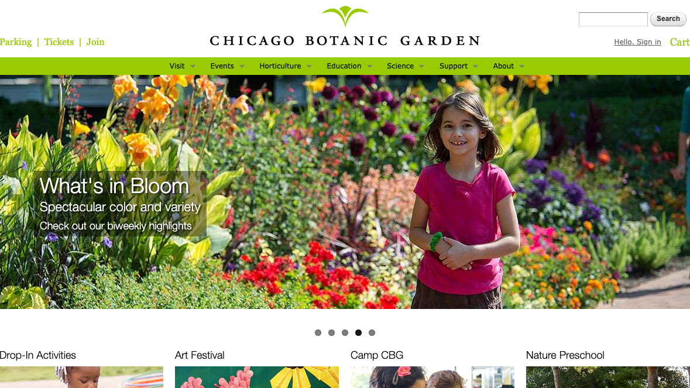
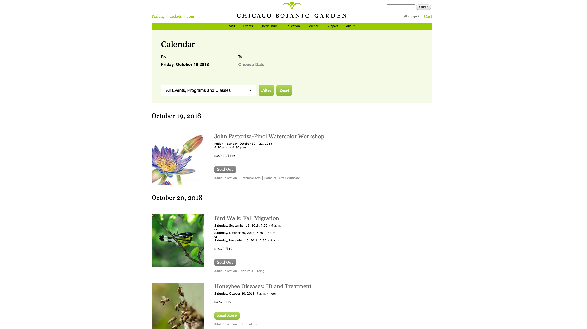

## Drupal Commerce
The Chicago Botanic Garden was an online point of sale system for guests of the garden who wanted to purchase event tickets, memberships, and parking passes in advance of coming to the park. It leveraged Drupal Commerce on Drupal 7 to create a fast, beautiful and easy to use website to help guests find the passes they need for the events they wanted to attend. CBG runs 4 annual events that have high volume and require ticketing for very specific time slots. Drupal Commerce was instrumental in keeping straight which event times there were, how many tickets were available, and what the pricing was.
    
## Gateway Ticketing / Galaxy Backend
CBG needed ticketing availability on the website to match the availability in the Gateway Ticketing backend. On-premise ticket sales and website ticket sales fed into the same Gateway system upon checkout. Some events had limited ticket availability, so if tickets were sold in one location, the other needed to have its inventory updated. This was especially important during their four main seasonal tour events that required tickets to be purchased for a specific time slot, with tours happening every 15 minutes or half-hour. Inventory for each time slot had to be tracked individually and reported to the customer so they didn't purchase tickets and then get to the garden to find out that there was a double booking!

What's more, pricing for ticketed events could fluctuate depending on various factors like special promotional discounts for particular days of the week. Another example would be tickets that would be more expensive to buy the closer the purchase was made to the actual event. Add to this the discounts available for members, seniors and children, and a very complex algorithm existed for determining what price to actually charge for the tickets in any given Drupal Commerce cart. 

The source of truth for all of this information was the Gateway backend, with which the website communicated through the eGalaxy API. Through this API, we validated membership passes before applying discounts, submitted carts for up-to-the minute pricing before checkout, received updated stock counts for tickets with limited availability and placed temporary holds on tickets for such events when added to the cart. Then once an order was checked out on the site, a final API call to capture the final details of the order was submitted to Gateway through the API. 

On a nightly and weekly basis, data was imported back into the website from Gateway and other CRM backend systems to keep the website up-to-date through two imports. The first was a nightly update of events and time slots which were used to keep the Commerce product and variant entities up-to-date. The second was a weekly import of a matrix of Membership IDs so users could enter their IDs and have them validated to get discounts. The imports were accomplished using Elysia Cron (the old Drupal 7 module that did the same thing as Ultimate Cron which replaced it from Drupal 8 onward) and Drupal's queue processing API.
    
## Event Calendar
Garden visitors needed a way to find the tickets they wanted to purchase so they could gain admission to the Garden. I developed a search feature with filters that presented the user with a list of matching events they could choose from. These events were arranged in order from soonest to furthest in the future. They listed pricing and availability and allowed the user to open the full event detail page for further information and ticket purchasing. When an event was sold out, we would gray out the button so users knew immediately that the event had no more tickets available.
        
