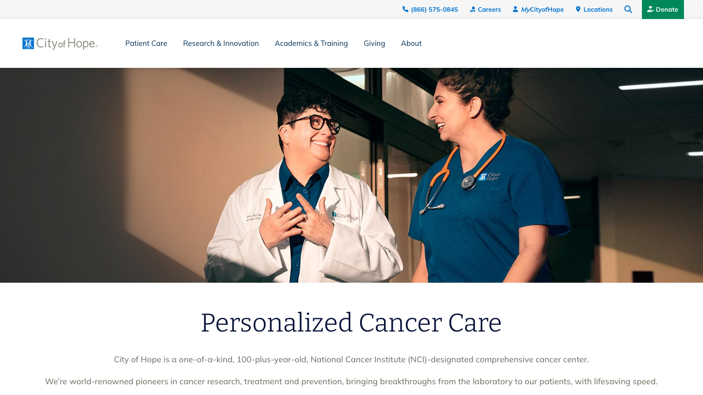

## Project Details

### Data Migration
City of Hope had over 6,000 pages across a variety of templates and nested in a hierarchical structure in a site built on Oracle WebCenter Sites. We created a series of new well-crafted content types, paragraph components and taxonomies and used the Drupal migrate module to import these pages into Drupal, creating beautiful easily searchable pages.
    
### Design Refresh
Building a new website on Drupal gave us a great opportunity to refresh the design of the site, bringing the look of City of Hope into the modern age of web.

#### Left Nav
A selection of pages feature a "Left Nav" that link related pages together. The linking for these pages was imported during the migration from the old site, which used Oracle WCS's Hierarchical Content Services (HCS) to create hierarchical relationships. Such hierarchical relationships do not exist natively within Drupal, so we had to get creative by creating a menu system using BigMenu and a Paragraph Bundle with an block embed field and options provided by the [Menu Block](https://www.drupal.org/project/menu_block) module that allowed selection of a specific point in the menu tree to use as the top level of the nav. 

### Robust Search
Bringing City of Hope's content into Drupal allowed us to leverage the Search API along with the taxonomy and content type models we designed to create a robust search experience. Using Search API, Apache Solr, Facets, Drupal Views and Google Maps Geolocation, we were able to generate a Find a Doctor search and a Find a Location search in addition to their global site search. These new searches are fast and accurate.

#### Search Journey Paths
Having done that, we went to the next step and created a bespoke system of Search Journey entities that City of Hope site admins could use to comb the search results based on the section of the site a user is in and other factors. This gave City of Hope full control of the search experience so they can make sure users find exactly the page(s) they need.

## Project Results

City of Hope now has a state of the art, gorgeous web presence that is easy to manage for all stakeholders and makes it easy for site visitors to find exactly what they need quickly while still having a large volume of information. 

### Award Winning Development
In September of 2022, City of Hope was awarded the eHealthcare Leadership Platinum award for Best Site Design for a Hospital with 200-399 Beds.
. 

The eHealthcare Leadership Awards recognize outstanding health websites and digital initiatives, highlighting the role of digital communications in achieving healthcare organizations' business objectives. 