[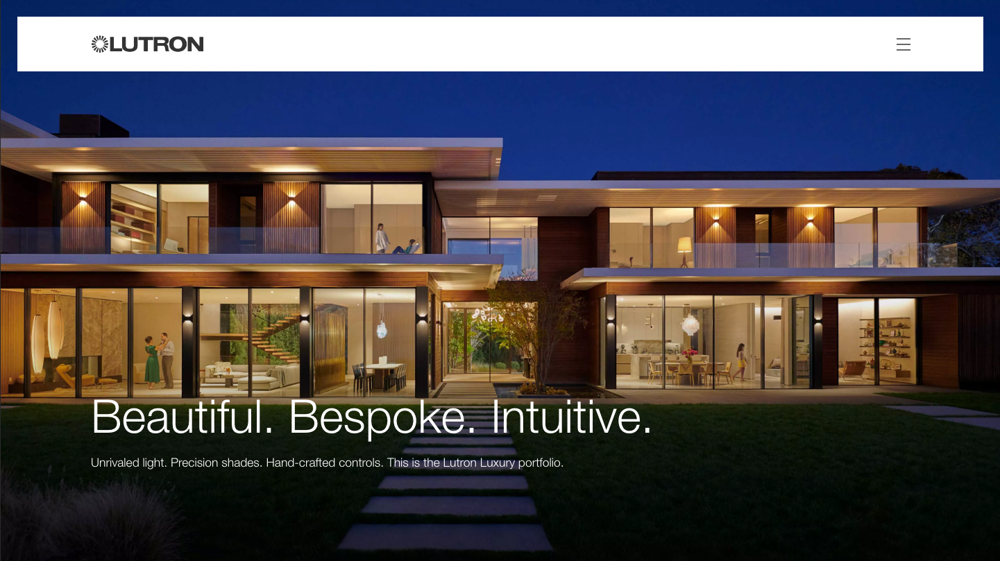](https://luxury.lutron.com)

## Project Details
### Floating Navigation
The Lutron Design Team designed a floating navigation menu that stays in place as the page is scrolled. Even on Desktop, navigation is accessed via the hamburger menu, which opens the navigation pane.

```grid|3|Floating Nav on Mobile
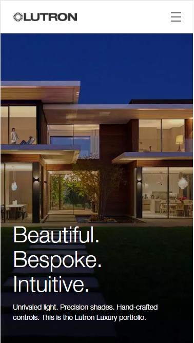
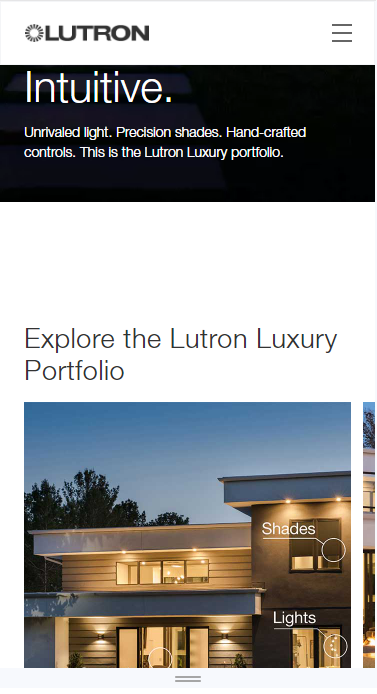
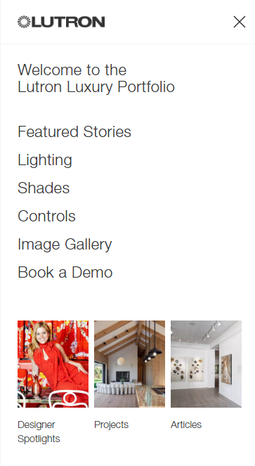
```

```grid|3|Floating Nav on Desktop
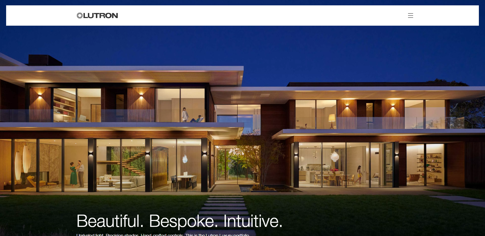
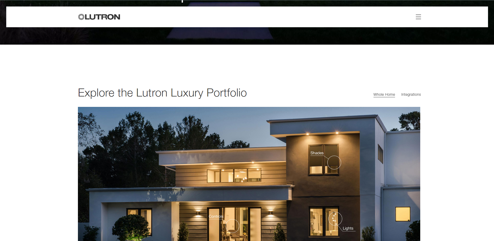
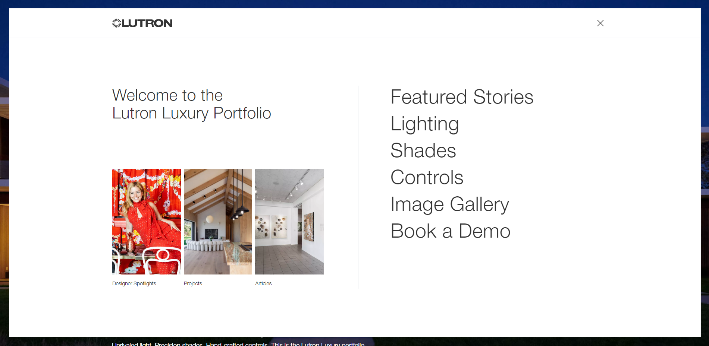
```

### Content Hub
Luxury designers like Sasha Bikoff have used Lutron projects to create stunning interior designs that can only be considered works of art. In order to show off these projects, and highlight the ways that Lutron facilitated their creation, a Content Hub featured a filterable list of articles, visually stunning components, and engaging animations was created.


```grid|2|Content Hub
[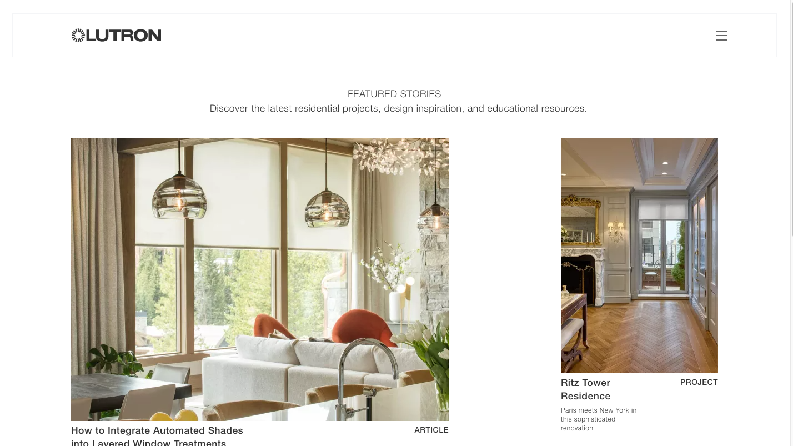](https://luxury.lutron.com/stories)
[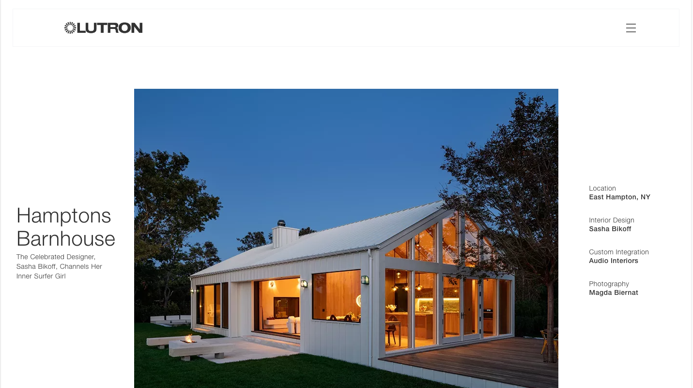](https://luxury.lutron.com/stories/hamptons-barnhouse-case-study)
```

#### Masonry Grid
The design specified the display of Content HUb articles in a masonry grid, with a flexible layout. Content authors needed to be able to adjust the sizing and positioning of listing media shown in the teasers on the grid. Further, teasers were to show one image by default, but switch to another graphic on hover. We accomplished this by adding fields to the content hub article content types that allowed the content authors to specify the foreground and background (hover) listing media, select the sizing (which corresponded to a Drupal Image Style) and positioning within the masonry grid.


```grid|2|Masonry Grid
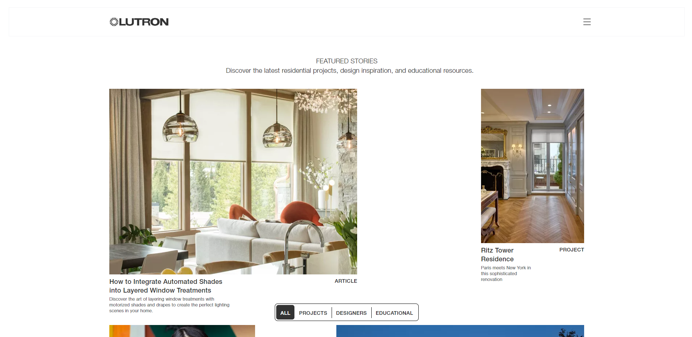
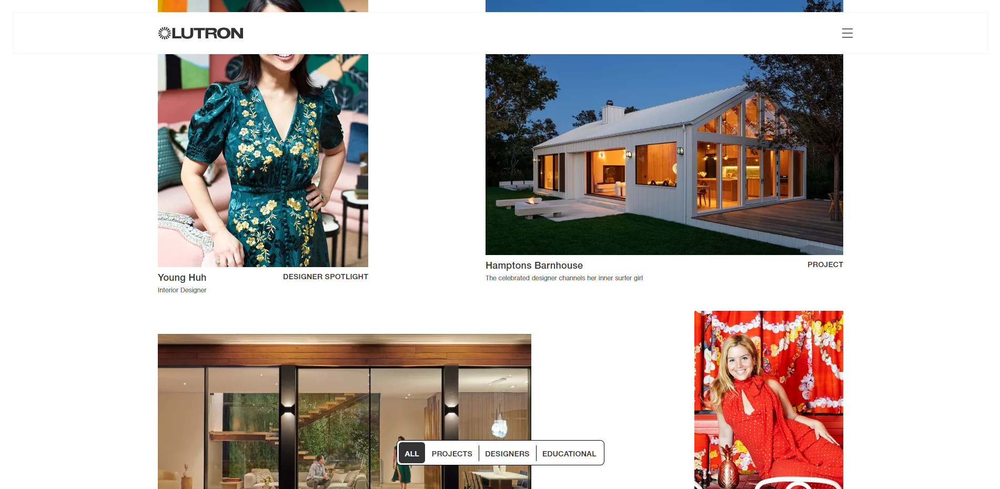
```

#### Page Transitions
Even though the Content Hub was built using Drupal Views to display Drupal nodes as teasers, the design specified the user experience to mimic that of a single-page app. We created a fade transition between pages of the hub by using Drupal's JavaScript AJAX library. We loaded the target page with the "{{INSERT DETAIL HERE}}" query parameter to fetch the main content of the page only (without the surrounding theme). Then we added the page to the DOM and used JavaScript animations to fade out the current page and fade in the new page. The final step was to modify the browser's history so the URL of the new page would display. This behavior mimics what might be experienced on a site built with a front-end framework like React, but all within the confines of a Drupal theme.

### Image Gallery
Home spaces that are augmented with Lutron projects create stunning visuals that must be shown off! The Image Gallery collects photographs from all the various projects into an array of high quality graphics that provide inspiration to anyone who wants to spruce up their decor.

```grid|1|Image Gallery on Mobile
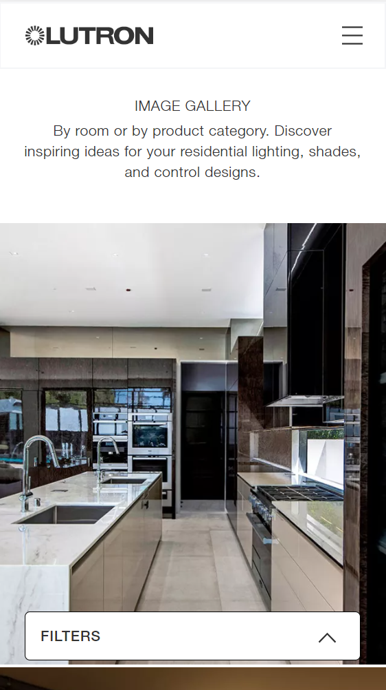
```
```grid|1|Image Gallery on Desktop
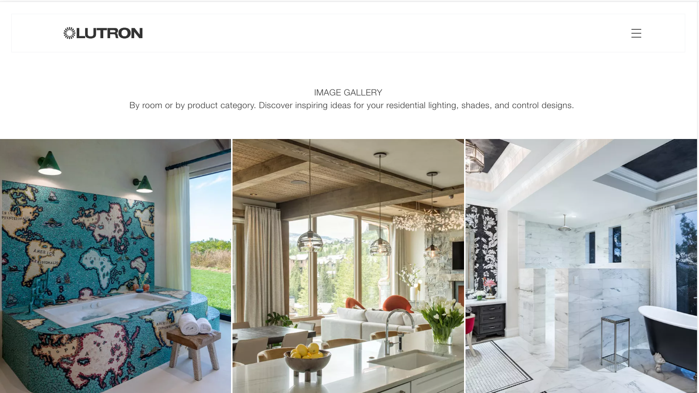
```

### Acquia Site Studio
Under the hood, the Lutron website was built using [Acquia Site Studio](https://sitestudiodocs.acquia.com/7.3). Site Studio allows construction and arrangement of content components with no backend coding required. Components can be created as building blocks to be used to build larger components, or saved as templates that can be dropped in and arranged on any page. The flexibility of Site Studio is virtually endless.

### Project Results
Thanks to our efforts, Lutron had a beautiful website that showed off their products in stunningly vibrant detail to go along with press releases as they launched a new media campaign to reach designers and customers who could benefit from the briliant touch that Lutron can add to their home.