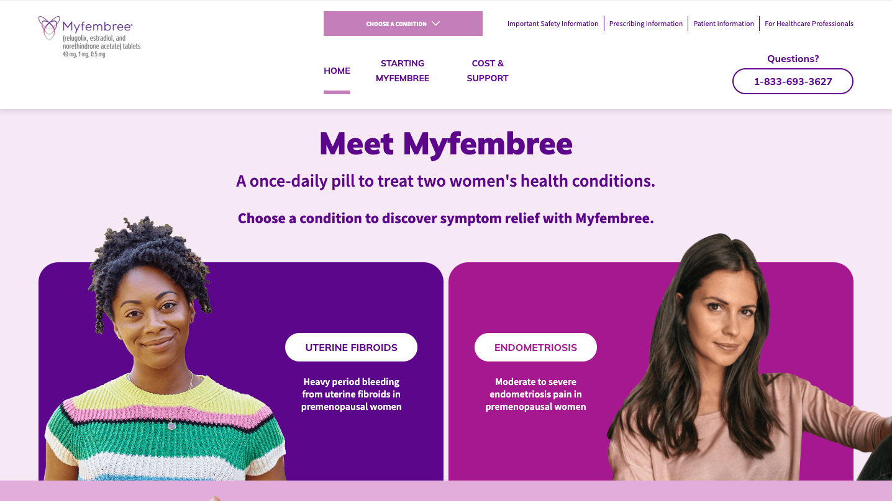

## Project Overview
### Fast Compliant Website',
MyFembree was a React project using Gatsby. The website is fast and simple, providing women who suffer with one of two health conditions information about MyFembree. From the site, prospective patients learn how to talk to their doctors about MyFembree and what to expect when taking it. Content on the site had to be validated by a review board down to the letter for compliance with FDA regulations. Once approved, any change would require a re-review of the entire site. So we were able to use Gatsby without even an API backend to lock in the specific verbiage and bundle the site as an extremely performant single-page app.

## Project Details

## Project Results