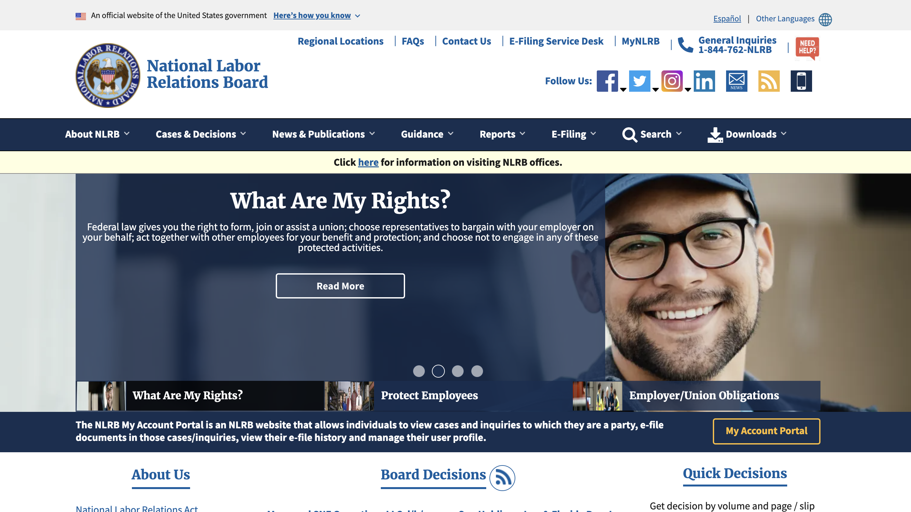

### Rescuing a Derailed Project
In Q3 of 2019, NLRB embarked on a 12 month project to migrate their site to Drupal 8 from Drupal 7, implement new Apache Solr based search interfaces to allow the public to search FOIA records, Case Decisions, and ongoing case filings that had been publicly released. Further, the site needed Spanish translation, Single Sign on, and many other improvements. I was brought on 6 months into the project when the entire development team had resigned and the project was significantly behind schedule. Through effective communication and teamwork, we were able to get the project back on track and complete all objectives by the end of Q3 2020.
